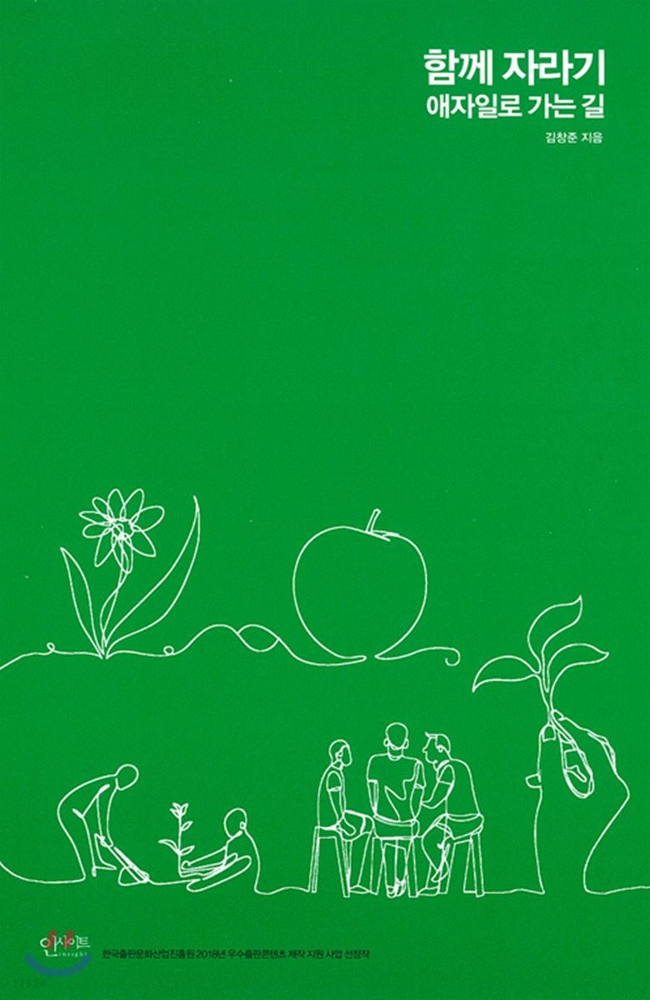

# ReadingThinkingSharing

## 개요

> 책을 읽고 얻은 인사이트 공유를 해보면 어떨까?

책을 읽고 요약하는 형식으로 글을 작성을 하게 되면 나중엔 정리한 글을 읽지도 않고 기억에도 오래 남지 않게 됩니다. 

하지만 이곳은 내용 정리가 아니라 인사이트에 집중합니다. 

책 한 권을 읽고 **단 한 가지 인사이트**를 건져낼 수 있다면 그것만으로 충분하다고 생각합니다. 

누구든지 편하게 본인이 읽은 책에서 얻은 인사이트를 이곳에 작성하고 공유하며 다양한 사람과 자신의 생각을 나누는 재미를 느낄 수 있으면 좋겠습니다.

## 인사이트(Insigt)

인사이트에 대한 사전적 정의는 “통찰, 즉 본질을 꿰뚫어봄”을 의미합니다.

단순히 책을 읽고 요약하는 글을 작성하는 것이 아니라 우선 **글에 대한 본인의 생각을 글로 녹여낼 수 있어야 합니다.**

보통은 아래와 같은 형식이 될 겁니다.

- 책 본문 인용
- 이것에 대한 나의 생각

하지만 여기서 조금 더 깊이 들어간다면 나의 생각에 “깨달은 것”에 대한 내용이 들어가 있어야 합니다. 

즉, 책을 통해 기존에는 잘 이해가 안 됐던 개념이 한순간에 정리가 된 경험 또는 기존에 가지고 있던 개념과 책 내용이 서로 결합하여 생겨난 본인만의 새로운 시각 등을 녹여낼 수 있다면 더할 나위 없습니다.

## 진행 방식

먼저 회차 별로 책을 선정합니다.

선정한 책을 기간 내에 읽고 리뷰를 작성한 다음 PR를 통해 함께 함께하는 참가자들의 리뷰를 받으면서 진행을 합니다.

회차 별 전반적인 일정은 아래 표과 같습니다.

| 일 | 월 | 화 | 수 | 목 | 금 | 토 |
| --- | --- | --- | --- | --- | --- | --- |
| 독서  | 독서 | 독서  | 독서  | 독서 | 독서 | 독서 | 
| 일 | 월 | 화 | 수 | 목 | 금 | 토 |
| 독서  | 독서  |  `리뷰 요청` | 리뷰 작성  | 리뷰 작성 | `미팅` | 독서 | 

## 책 리뷰 작성과 관련된 가이드

리뷰 분량은 정해놓지 않고 자유롭게 작성하는 것을 원칙으로 합니다.

다만, 각 회차별로 논의 주제를 최소 2가지 정도 작성하는 것을 권장합니다.

논의할 주제를 권장하는 이유는 해당 리뷰를 읽은 다른 사람들이 작성된 논의 주제를 토대로 본인의 생각을 작성을 할 수 있기 때문에 조금 더 풍성한 리뷰가 진행될 수 있게 도와줍니다.

## 진행 회차 별 정리
| 회차 | 선정된 책 | 참여자 |
| --- | ------- | --- |
| 1회차 | 함께 자라기 | 이민형, 진우원, 차동훈, 최하연 | 

## 1회차 정리
### 선정된 책
\
[클릭 시 YES 24 책 소개 페이지로 이동]

### 참가자
이민형, 진우원, 차동훈, 최하연

### 미팅 일정

| 미팅 회차 | 미팅 일정 | 범위 |
| ------- | ------- | --- |
| 1회차 | 9월 16일 | 오리엔테이션 |
| 2회차 | 9월 30일 | 1부 달인이 되는 비결  |
| 3회차 | 10월 14일 | 1부 나홀로 전문가에 대한 미신 |
| 4회차 | 10월 28일 | 2부 이것도 모르세요? |
| 5회차 | 11월 11일 | 3부 애자일을 애지일스럽게 도입하기 |